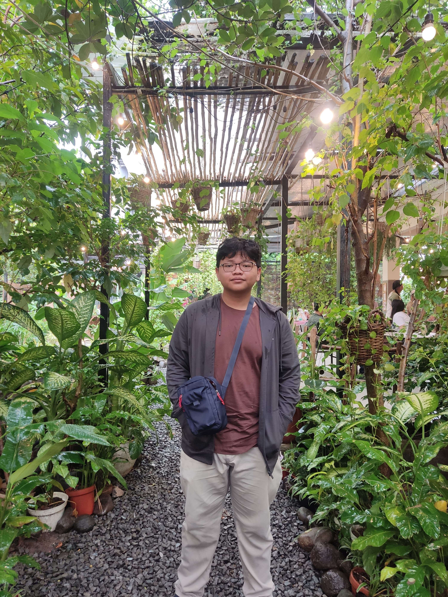

# UTS-1 All About Me

{width=950%}

**Nizham Rafa Lazuardi** adalah mahasiswa **Sistem dan Teknologi Informasi ITB** yang sedang menapaki dunia yang seimbang antara logika dan kreativitas. Ia tertarik pada **game development, UI/UX, dan artificial intelligence**, tiga bidang yang menurutnya sama-sama menantang dan menyenangkan karena semua berbicara tentang satu hal: **bagaimana manusia berinteraksi dengan sistem yang mereka ciptakan sendiri.**

Lahir dan besar di Indonesia, Nizham saat ini menempuh semester awal di STEI-K ITB. Di luar kuliah, ia suka mengulik ide-ide game yang “nggak biasa”, misalnya memadukan konsep klasik dengan mekanik baru yang menuntut pemain berpikir strategis sekaligus reflektif. Ia percaya bahwa permainan terbaik bukan hanya menghibur, tetapi juga membuat pemain *merasakan sesuatu tentang dirinya sendiri.*

Di dunia nyata, Nizham dikenal sebagai seseorang yang suka berpikir dalam, kadang terlalu dalam hingga lupa makan siang. Tapi, bagi dia, berpikir adalah bentuk hiburan yang tak kalah menarik dari bermain game.  

Instagram? Masih kosong. Blog? Sedang dalam tahap “nanti kalau sempat.” Tapi pikirannya selalu aktif di mana pun ia berada.

Apa gagasan yang sedang ia pikirkan?

---

## **Kisah yang Membentuk Diri Saya: Antara Pixel, Makna, dan Manusia**

Manusia menciptakan cerita untuk memahami dunia, dan mungkin itu alasan mengapa saya jatuh cinta pada dunia game. Game adalah bentuk narasi interaktif: pemain membuat pilihan, menanggung konsekuensi, dan akhirnya menulis kisahnya sendiri. Di sanalah saya sadar bahwa hidup pun bekerja dengan cara yang sama.

Bagi saya, belajar komunikasi interpersonal seperti *debugging* hubungan antar manusia. Kita semua punya “kode sosial” yang kompleks, dan terkadang kesalahan kecil dalam ekspresi bisa membuat seluruh sistem interaksi “crash.” Tapi justru di situ letak seninya: memahami orang lain bukanlah tentang menjadi sempurna, melainkan tentang *belajar membaca sinyal-sinyal halus yang sering kita abaikan.*

Saya melihat bahwa keahlian berbicara dan mendengar seimbang seperti desain UI yang baik: intuitif, responsif, dan punya *feedback loop* yang jujur. Sebuah percakapan yang sehat, seperti game yang baik, membuat kita ingin terus bermain, bukan cepat keluar.

---

### **1. Diri Saya dan “Tiga Lapisan Game” Kehidupan**

Kalau psikolog Dan McAdams punya “tiga lapisan kepribadian,” maka saya menyebutnya **tiga lapisan game kehidupan.**

- **Level 1: Core Mechanics**  
  Ini adalah dasar: kepribadian dan kebiasaan saya. Saya tipe yang reflektif, suka analisis, tapi mudah terjebak dalam “overthinking loop.”  

- **Level 2: Player Goals**  
  Ini soal nilai dan tujuan hidup. Saya ingin menciptakan sesuatu yang *meaningful*, baik lewat game, tulisan, atau ide. Bukan sekadar keren secara teknis, tapi juga menyentuh sisi manusia.  

- **Level 3: Narrative Layer**  
  Ini adalah cerita yang saya tulis sendiri tentang siapa saya dan bagaimana saya sampai di sini. Cerita tentang mencoba, gagal, belajar, dan meski kadang pelan, tetap melangkah.

Dari sini saya belajar satu hal penting: kita bisa saja belum tahu ke mana jalan ini akan membawa, tapi selama kita terus menulis dan bereksperimen, cerita itu akan menemukan bentuknya sendiri.

---

### **2. Mengubah Kegagalan Jadi “Level-Up”: Seni Menyusun Narasi Diri**

Dalam hidup, seperti dalam game, tidak semua percobaan berhasil. Tapi yang menarik adalah: *gagal itu bukan game over*, melainkan peluang untuk *grind* lagi dengan strategi baru.

Saya pernah terjebak dalam pola berpikir “kalau gagal berarti saya tidak cukup baik.” Sekarang, saya mencoba membingkainya ulang: *“kalau gagal, berarti sistem saya baru saja memberi feedback.”*  
Sama seperti bug, kesalahan memberi kita petunjuk untuk memperbaiki diri. Cerita hidup yang sehat bukanlah yang tanpa error, tapi yang terus diperbarui dengan versi yang lebih stabil.

Dan mungkin itulah inti dari komunikasi juga: memperbarui “patch notes” tentang diri kita agar hubungan kita dengan orang lain tidak stuck di versi lama.

---

### **3. Momen “Debugging Diri”: Refleksi yang Mengubah Cara Pandang**

Ada satu hal yang saya pelajari dari dunia teknologi: semua sistem bisa di-*trace back* jika kita cukup sabar mencari log-nya. Begitu pula dengan diri sendiri.

Saya belajar bahwa rasa canggung, kelelahan sosial, atau bahkan ketidakpastian bukanlah bug, melainkan bagian dari proses *testing.*  
Setiap percakapan, setiap interaksi, adalah uji coba yang membawa saya lebih dekat pada versi diri yang lebih matang, versi yang lebih tahu kapan harus berbicara dan kapan cukup mendengarkan.

---

### **4. Kesimpulan: Hidup Sebagai Proyek Open Source**

Pada akhirnya, saya melihat diri saya seperti proyek *open source*: selalu dalam pengembangan, terbuka terhadap masukan, dan dikelola dengan campuran semangat dan kekacauan. Setiap pengalaman baru adalah *pull request* yang kadang bikin bingung, tapi sering kali memperkaya.

Saya tidak tahu *final release* versi diri saya akan seperti apa nanti. Tapi kalau saya bisa menulis changelog kecil hari ini, mungkin bunyinya begini:

> “Ditambahkan pemahaman baru tentang pentingnya koneksi antarmanusia.  
>  Diperbaiki bug perfeksionisme.  
>  Ditingkatkan stabilitas empati.”

Dan dengan setiap update, saya berharap menjadi manusia yang tidak hanya lebih pintar, tapi juga lebih hangat.
